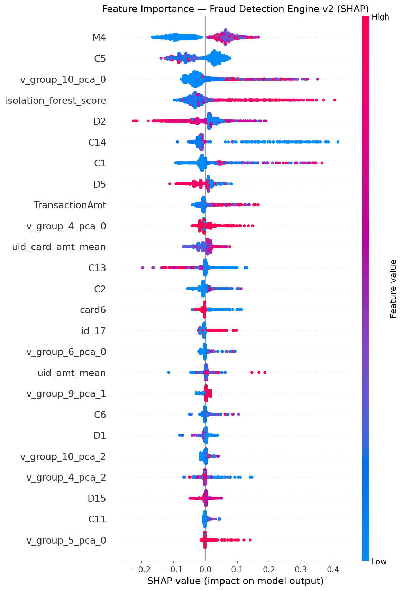

# Fraud Detection Engine
### Real-Time Transaction Risk Scoring | XGBoost + CatBoost + LightGBM Ensemble | FastAPI

---

## Overview

A production-grade fraud detection system built on the IEEE-CIS Kaggle dataset (590K transactions, 3.5% fraud rate). The system frames fraud detection as a **real-time behavioral anomaly problem** — not just "is this transaction fraud?" but "how anomalous is this transaction given everything we know about this card, device, and user?"

This mirrors the design of risk-adaptive ML systems used in production security infrastructure: layered detection (supervised + unsupervised), behavioral feature engineering, explainable decisions, and a serving layer that returns risk scores in real time.

---
## Business Problem

Payment fraud costs the global economy over **$32 billion annually**. For a company like Uber processing millions of transactions daily, even a 0.1% fraud rate translates to millions in losses — plus the hidden costs of damaged customer trust when legitimate users get blocked.

The core challenge is asymmetric: fraud is rare (3.5% of transactions in this dataset), real-time (decisions must happen in milliseconds before a payment clears), and adversarial (fraudsters actively adapt to detection systems).

Traditional rule-based systems — "block all transactions over $1,000 from new devices" — are too rigid. They miss sophisticated fraud patterns and block legitimate customers. The solution is a **risk-adaptive ML system** that scores every transaction dynamically based on behavioral signals, entity history, and anomaly detection.

## How We Solved It

We built a layered fraud detection engine that mirrors production systems at companies like Stripe, PayPal, and Uber:

**1. Behavioral Identity Reconstruction**
The dataset has no explicit user ID. We reverse-engineered 41,932 unique client identities from card and address signals — unlocking transaction history, spending baselines, and velocity features per client. This shifted the problem from "is this transaction suspicious?" to "is this client's behavior suspicious?" — a fundamentally stronger signal.

**2. Layered Detection Architecture**
- **Isolation Forest** catches zero-day fraud — anomalies that don't match any known pattern
- **XGBoost + CatBoost** catch known fraud patterns using labeled history
- The unsupervised anomaly score feeds into the supervised models as a feature — giving them an early warning signal

**3. Production-Grade Pipeline**
- Serialized `FeaturePipeline` ensures identical transformations at training and serving time — eliminating training-serving skew
- Decision threshold tuned using F-beta (β=2) to weight recall over precision — missing fraud costs more than a false alarm
- Every experiment tracked in MLflow for reproducibility and auditability
- REST API returns fraud probability + risk decision + SHAP explanations in real time


## Results

| Model | ROC-AUC | PR-AUC |
|---|---|---|
| Isolation Forest (unsupervised baseline) | 0.7329 | 0.0888 |
| LightGBM | 0.8617 | 0.3556 |
| CatBoost | 0.9209 | 0.5839 |
| XGBoost | 0.9221 | 0.6003 |
| **Ensemble (XGBoost + CatBoost + LightGBM)** | **0.9246** | **0.6031** |

**Primary metric: PR-AUC** — ROC-AUC flatters imbalanced classifiers. With 3.5% fraud rate, a model predicting "legit" for everything scores 0.5 ROC-AUC but catches zero fraud. PR-AUC measures performance on the minority class directly.

---

## Architecture
Raw Data (590K transactions)

│

▼

┌─────────────────────────────────────────────┐

│           Feature Engineering (v2)          │

│  - UID reconstruction (41,932 clients)      │

│  - Client behavioral baselines              │

│  - V-column PCA reduction (339 → 33 cols)  │

│  - Transaction velocity features            │

│  - Frequency encoding (rare = risky)        │

│  - Null pattern features                    │

└──────────────────┬──────────────────────────┘

│

┌─────────────┼─────────────┐

▼             ▼             ▼

┌─────────┐  ┌─────────┐  ┌──────────┐

│Isolation│  │ XGBoost │  │CatBoost  │

│ Forest  │  │PR-AUC   │  │PR-AUC    │

│(unsup.) │  │0.6003   │  │0.5839    │

└────┬────┘  └────┬────┘  └────┬─────┘

│             │             │

│    IF score as feature    │

└─────────────┼─────────────┘

▼

┌─────────────────────┐

│  Weighted Ensemble  │

│  PR-AUC: 0.6031     │

│  ROC-AUC: 0.9246    │

└──────────┬──────────┘

│

┌──────────────────────┐

│   MLflow Tracking    │

│  All runs logged     │

└──────────┬───────────┘

│

┌──────────────────────┐

│  FastAPI /predict    │

│  fraud_probability   │

│  risk_decision       │

│  top_risk_factors    │

│  (SHAP explanations) │

└──────────────────────┘

---

## Feature Importance (SHAP)



---

## Key Design Decisions

### Why PR-AUC instead of ROC-AUC?
ROC-AUC is dominated by the 96.5% legitimate majority. PR-AUC measures performance on the fraud class directly — every false alarm hurts Precision, every missed fraud hurts Recall. The Kaggle competition used ROC-AUC because it was fixed by the organizers. In production, PR-AUC is the honest metric.

### Why UID engineering?
The dataset has no explicit user ID. By combining `card1 + card2 + card4 + card6 + addr1 + addr2` we reconstructed 41,932 unique client identities. This unlocked client-level behavioral features — amount baselines, transaction velocity, first-transaction flags — the single biggest improvement in the winning Kaggle solution.

### Why -999 sentinel imputation instead of mean?
Tree-based models learn that -999 is itself predictive — a missing device fingerprint signals higher risk. Mean imputation destroys this signal.

### Why time-based train/val split?
Random splitting leaks future information into training. Models always predict on future data in production. Time-based splitting gives an honest performance estimate.

### Why scale_pos_weight instead of SMOTE?
With 462 features and complex interactions between card identifiers, device fingerprints, and behavioral signals, SMOTE creates synthetic transactions that violate natural correlation structure. scale_pos_weight adjusts the loss function directly without touching the data distribution.

### Why Isolation Forest alongside supervised models?
Supervised models only catch fraud patterns they've seen before. Isolation Forest catches zero-day fraud — anomalies that are structurally unusual even without a label. The IF anomaly score is fed as an input feature to XGBoost and CatBoost, giving supervised models an unsupervised signal.

### Production Considerations
The V-columns (V1–V339) in IEEE-CIS are Vesta's proprietary payment processor signals — device fingerprints, velocity checks, behavioral biometrics computed across millions of transactions in real time. They carry the majority of fraud signal in training. At API serving time, these aren't available without Vesta's infrastructure. In production, equivalent signals would come from a real-time Feature Store. The API demonstrates the correct serving architecture — serialized feature pipeline, consistent transformations, SHAP explanations — using the features available at inference time.

---

## Project Structure
fraud-detection-engine/

├── data/

│   ├── raw/                    # IEEE-CIS CSVs (gitignored)

│   └── processed/              # Features + pipeline (gitignored)

├── src/

│   ├── features.py             # Feature engineering + FeaturePipeline class

│   ├── model.py                # Training: LightGBM + XGBoost + CatBoost

│   ├── pipeline.py             # End-to-end orchestrator

│   └── serve.py                # FastAPI serving endpoint

├── tests/

│   └── test_features.py        # 19 unit tests (all passing)

├── outputs/

│   └── shap_summary_v2.png     # Feature importance plot

├── mlruns/                     # MLflow experiment artifacts

├── requirements.txt

└── README.md

---

## Setup & Usage

### 1. Install dependencies
```bash
conda create -n fraud-detection python=3.10 -y
conda activate fraud-detection
conda install -c conda-forge pandas numpy scikit-learn lightgbm xgboost matplotlib seaborn pyarrow fastapi uvicorn pytest shap -y
pip install mlflow==2.8.0 catboost cloudpickle
```

### 2. Download data
Download `train_transaction.csv` and `train_identity.csv` from [Kaggle](https://www.kaggle.com/c/ieee-fraud-detection/data) and place in `data/raw/`.

### 3. Run the full pipeline
```bash
python src/pipeline.py
```

### 4. View MLflow experiments
```bash
mlflow ui
# Open http://localhost:5000
```

### 5. Start the API
```bash
uvicorn src.serve:app --reload --port 8000
# Docs at http://localhost:8000/docs
```

### 6. Score a transaction
```bash
curl -X POST http://localhost:8000/predict \
  -H "Content-Type: application/json" \
  -d '{
    "TransactionAmt": 1500.00,
    "card4": "visa",
    "P_emaildomain": "protonmail.com",
    "tx_hour": 3,
    "DeviceType": "mobile"
  }'
```

**Response:**
```json
{
  "fraud_probability": 0.0085,
  "risk_decision": "APPROVE",
  "risk_level": "LOW",
  "decision_threshold": 0.3,
  "top_risk_factors": [
    {"feature": "tx_amt_log", "shap_value": 0.0021, "direction": "increases_risk"},
    {"feature": "is_night", "shap_value": 0.0018, "direction": "increases_risk"},
    {"feature": "P_emaildomain_freq", "shap_value": 0.0012, "direction": "increases_risk"}
  ],
  "processing_time_ms": 685.0,
  "model_version": "2.0.0"
}
```

### 7. Run tests
```bash
pytest tests/ -v
# 19 passed
```

---

## Author

**Olalekan Michael Ogunsola**

[GitHub](https://github.com/ogunsolaolalekanoo-dev) | [LinkedIn](https://linkedin.com/in/olalekan-ogunsola)